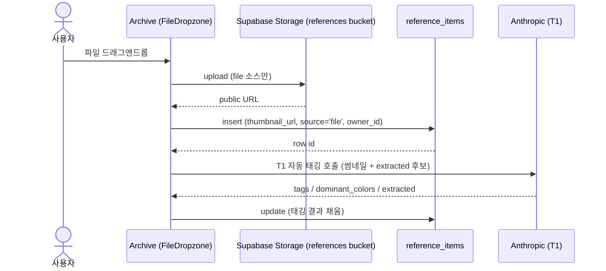
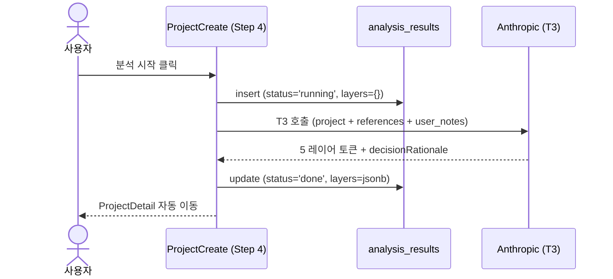
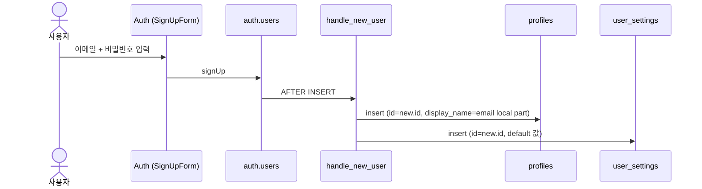

# MUSE. Data Bridge

> ux-flow 의 데이터 모델이 Supabase 와 어떻게 연결되는지 설명.
> 컬럼 / 제약 / SQL 은 [appendix-db-schema.md](./appendix-db-schema.md) 참조.

**입력**: [02-ux-flow.md § 데이터 모델 활용](./02-ux-flow.md)

**합의 기록**:

- 모든 사용자 데이터는 owner-only (Reference / Project 모두 다중 사용자 공유 없음).
- `Reference.thumbnailUrl` 은 source 에 따라 분기: `file` 업로드 = Supabase Storage 의 public URL / `url` 입력 = 외부 URL 그대로 저장.
- `AnalysisResult.layers` 는 jsonb 단일 컬럼으로 통째 보관 (별도 토큰 테이블 분리 없음).
- 삭제 정책: 모든 테이블 hard delete.
- 가입 트리거에서 `profiles` + `user_settings` default row 자동 생성.

## 1. 데이터 모델은 어떤 DB 테이블이 되나?

ux-flow § 데이터 모델 활용을 그대로 인용. 데이터명이 어느 Supabase 테이블에 저장되는지 1:1.

| 데이터명 | 예상 테이블명 | 설명 (1줄) |
|---|---|---|
| `Reference` | `reference_items` | 사용자가 모은 영감 이미지 + 자동 태깅 결과 |
| `Project` | `projects` | 의도 + 모드 + 레퍼런스 큐레이션 묶음 (5-step 위자드 산출) |
| `ProjectReference` | `project_references` | 프로젝트가 어떤 레퍼런스를 어떤 레이어로 활용 (M:N) |
| `AnalysisResult` | `analysis_results` | AI 가 만든 5 레이어 토큰 묶음 + 결정 추적 |
| `UserSettings` | `user_settings` | 사용자별 AI 모델 / 스토리지 / 테마 (사용자당 1 row) |
| `User` | `auth.users` (Supabase 내장) + `profiles` | 가입 사용자. 표시 정보는 profiles 분리 |

> `profiles` 는 ux-flow 사전에는 없는 보조 테이블. Supabase Auth 가 `auth.users` 를 강제로 관리하므로, displayName / avatarUrl 같은 사용자 표시 정보는 별도 `profiles` 에 저장하고 가입 트리거로 자동 채움. 자세한 이유는 [appendix-auth-design.md](./appendix-auth-design.md).

## 1.5. DB 스펙 미리보기 (간단)

> 테이블별 컬럼 한 줄. 제약·인덱스·정책·트리거는 [appendix-db-schema.md](./appendix-db-schema.md). 타입은 PG 기본 표기.

### `reference_items`

| 컬럼 | 타입 | null | 설명 |
|---|---|---|---|
| `source` | text | ✗ | file / url |
| `thumbnail_url` | text | ✗ | 썸네일 URL (file = Storage public URL, url = 외부 URL) |
| `title` | text | ✓ | 사용자 지정 제목 |
| `tags` | jsonb | ✓ | 레이어별 태그 묶음 (색·타이포·레이아웃·그라디언트·비주얼디렉션) |
| `dominant_colors` | text[] | ✓ | 대표 색 HEX 1~5개 |
| `extracted` | jsonb | ✓ | T1 자동 태깅이 추출한 관찰 값 |
| `owner_id` | uuid (→ auth.users.id) | ✗ | 소유자 |

자동: `id` (uuid PK), `created_at`

### `projects`

| 컬럼 | 타입 | null | 설명 |
|---|---|---|---|
| `name` | text | ✗ | 프로젝트 이름 |
| `mode` | text | ✗ | concept / system |
| `intent` | text | ✓ | 한 줄 의도 (Step 1) |
| `user_notes` | text | ✓ | Step 3 활용 노트 |
| `reference_notes` | jsonb | ✓ | { refId: 텍스트 } (≤100자) |
| `owner_id` | uuid (→ auth.users.id) | ✗ | 소유자 |

자동: `id`, `created_at`, `updated_at`

> `referenceIds` 는 별도 컬럼 없음. M:N 매핑인 `project_references` 가 진실 원천.

### `project_references`

| 컬럼 | 타입 | null | 설명 |
|---|---|---|---|
| `project_id` | uuid (→ projects.id) | ✗ | 소속 프로젝트 |
| `reference_id` | uuid (→ reference_items.id) | ✗ | 큐레이션된 레퍼런스 |
| `use_layers` | text[] | ✓ | color / typography / layout / gradient / visualDirection. 빈 배열이면 자동 (T2 추천) |

자동: `id`

### `analysis_results`

| 컬럼 | 타입 | null | 설명 |
|---|---|---|---|
| `project_id` | uuid (→ projects.id) | ✗ | 소속 프로젝트 |
| `status` | text | ✗ | pending / running / done / error |
| `layers` | jsonb | ✗ | 5 레이어 토큰 묶음. 각 토큰의 label / isEnabled / emphasis / sourceReferenceIds / decisionRationale 모두 포함 |

자동: `id`, `updated_at`

> 각 토큰의 on/off + emphasis 편집은 `layers` jsonb 내부 필드 갱신. 별도 행 분리 없음.

### `user_settings`

| 컬럼 | 타입 | null | 설명 |
|---|---|---|---|
| `id` | uuid (→ auth.users.id) | ✗ | 사용자 1:1 (PK = FK) |
| `ai_model` | text | ✗ | T1/T2/T3 호출에 쓰는 모델명 |
| `storage_mode` | text | ✗ | local / cloud |
| `theme_mode` | text | ✗ | light / dark / system |
| `is_auto_tag_enabled` | boolean | ✗ | 업로드 시 자동 태깅 동작 여부 |

자동: `created_at`, `updated_at`

### `profiles`

| 컬럼 | 타입 | null | 설명 |
|---|---|---|---|
| `id` | uuid (→ auth.users.id) | ✗ | 사용자 1:1 (PK = FK) |
| `display_name` | text | ✓ | GNB 표시 이름 |
| `avatar_url` | text | ✓ | 프로필 이미지 URL |

자동: `created_at`, `updated_at`

> `email` 은 `auth.users` 가 보유. profiles 에 중복 저장 안 함.

## 2. UX-flow 의 어느 시점에 DB 가 업데이트되나?

ux-flow § UX-flow 단계별 서사를 따라가며, 각 단계에서 어떤 테이블이 변하는지.

### 시나리오 1. 레퍼런스 아카이빙

- **Archive 진입** → `reference_items` read (사용자 그리드)
- **이미지 업로드** (file) → Supabase Storage 에 원본 업로드 (bucket `references`) → public URL 획득 → `reference_items` insert (source='file', thumbnail_url=public URL, owner_id=현재 사용자)
- **이미지 업로드** (url) → `reference_items` insert (source='url', thumbnail_url=외부 URL 그대로). Storage 미사용.
- **자동 태깅 완료** (T1 호출 후) → 같은 row update (tags / dominant_colors / extracted 채움)

### 시나리오 2. 프로젝트 생성 5-step

- **Step 0 모드 선택** (ProjectCreate) → `projects` insert (mode 만 채워진 row, owner_id=현재 사용자)
- **Step 1 제목 + 의도** → 같은 projects row update (name, intent)
- **Step 2 레퍼런스 + layer chip** → 선택한 레퍼런스마다 `project_references` insert (use_layers=토글한 chip 배열). 칩 토글 시 use_layers 갱신.
- **Step 3 활용 노트** → projects row update (user_notes, reference_notes)
- **Step 4 AI 분석** → `analysis_results` insert (status='running' → Anthropic T3 응답 도착 → status='done', layers=jsonb)

### 시나리오 3. 토큰 확인 + 결정 추적

- **ProjectDetail 진입** → `projects` + `analysis_results` + `reference_items` read (사용된 ref strip)
- **토큰 카드 펼침** → 추가 호출 없음 (이미 read 한 layers jsonb 의 decisionRationale 인용)
- **on/off + emphasis 편집** → `analysis_results` row update (layers jsonb 의 해당 토큰 isEnabled / emphasis 필드만 patch)

### 시나리오 4. Export

- **DB 업데이트 없음**. 읽기만 (`projects` + `analysis_results` + `reference_items` 모두 R). Storage 의 reference 이미지 ZIP 번들링 시 read.

## 3. 각 페이지는 어떤 DB 와 연결되나?

페이지 중심 표. R = 읽기, W = 쓰기 (insert/update).

| 페이지 | 경로 | 다루는 테이블 | 동작 |
|---|---|---|---|
| Auth | `/auth` | `auth.users` + `profiles` + `user_settings` | W (가입 시 트리거로 자동 생성) |
| Archive | `/` | `reference_items` + Storage `references` bucket | W (업로드) + R (그리드) |
| ProjectList | `/projects` | `projects` | R |
| ProjectCreate | `/projects/new` | `projects` + `project_references` + `analysis_results` + `reference_items` | W (Step 0~4) + R (레퍼런스 선택) |
| ProjectDetail | `/projects/:id` | `analysis_results` + `projects` + `reference_items` | R + 토큰 편집 시 `analysis_results` W |
| Settings | `/settings` | `user_settings` | R + W |

## 4. 외부 의존 데이터의 라이프사이클

외부 API / Storage / Auth 가 끼는 데이터만 sequence.

### Reference (자동 태깅 + Storage 업로드)

### AnalysisResult (Anthropic 분석)

### Auth (회원가입 트리거)

## 5. 정합성 체크

- [x] § 1 의 데이터명·테이블명이 ux-flow 사전과 글자 단위 일치 (`Reference`/`reference_items`, `Project`/`projects`, `ProjectReference`/`project_references`, `AnalysisResult`/`analysis_results`, `UserSettings`/`user_settings`, `User`/`auth.users`)
- [x] § 1.5 의 컬럼명이 ux-flow 데이터 모델 카드의 필드 표 (camelCase) 와 snake_case 변환 규칙으로 1:1 일치 (`thumbnailUrl`/`thumbnail_url`, `dominantColors`/`dominant_colors`, `userNotes`/`user_notes`, `referenceNotes`/`reference_notes`, `useLayers`/`use_layers`, `aiModel`/`ai_model`, `storageMode`/`storage_mode`, `themeMode`/`theme_mode`, `isAutoTagEnabled`/`is_auto_tag_enabled`, `displayName`/`display_name`, `avatarUrl`/`avatar_url`)
- [x] § 1.5 의 컬럼 4개 (컬럼/타입/null/설명) 외 다른 컬럼 0건
- [x] § 2 의 단계가 ux-flow UX-flow 단계별 서사의 단계와 일치 (시나리오 1~4 의 모든 단계 커버)
- [x] § 3 의 페이지명이 ux-flow 페이지 리스트의 행과 글자 단위 일치 (Auth / Archive / ProjectList / ProjectCreate / ProjectDetail / Settings)
- [x] § 4 시퀀스의 외부 의존이 ux-flow 단계별 서사의 트리거와 일치 (자동 태깅 = T1, AI 분석 = T3, 회원가입 = Auth 트리거)
- [x] 본문 (§ 1.5 제외) 에 SQL/컬럼/제약/훅 코드 0건

## 참조

- [02-ux-flow.md](./02-ux-flow.md). 단일 진실 원천
- [appendix-db-schema.md](./appendix-db-schema.md). DDL + ERD + 마이그레이션 (Phase 1)
- [appendix-auth-design.md](./appendix-auth-design.md). 인증 + profiles 트리거 (Phase 2)
- [appendix-rls-policies.md](./appendix-rls-policies.md). RLS 정책 (Phase 3)
- [appendix-api-integration.md](./appendix-api-integration.md). 클라이언트 훅 + 마이그레이션 적용 (Phase 4·5)
- [appendix-edge-functions.md](./appendix-edge-functions.md). 외부 API 서버 이전 (Phase 6, 권장)
